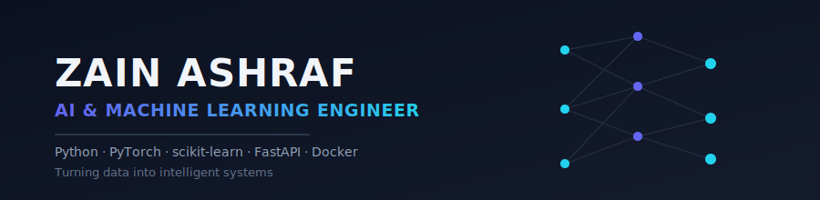

 

 

## 🧠 About Me

I'm a **Machine Learning Engineer** based in Faisalabad, Pakistan, currently pursuing **BS Data Analytics at GCU Faisalabad**. I build end-to-end ML/DL solutions — from data analysis and model training to deployment as production-ready APIs.

- 🔭 Currently working on: predictive ML models & applied deep learning projects
- 🌱 Currently learning: Transformers, LLMs (RAG, LangChain), and MLOps (Docker, FastAPI, MLflow)
- 🎯 Goal: Land a role as a Machine Learning / AI Engineer
- 💬 Ask me about: Python, scikit-learn, PyTorch, Data Analysis
- 📫 Reach me: **zainashraf3690@gmail.com**

 

## 🛠️ Tech Stack

 

<table align="center">
<tr>
<td valign="top" width="33%">

**Data & Analysis**
- NumPy
- Pandas
- Matplotlib / Seaborn
- Exploratory Data Analysis

</td>
<td valign="top" width="33%">

**Machine Learning**
- scikit-learn
- XGBoost
- Regression & Classification
- Clustering (KMeans, PCA)

</td>
<td valign="top" width="33%">

**Deep Learning & GenAI**
- PyTorch (CNN, RNN/LSTM)
- HuggingFace Transformers
- LangChain / RAG
- Fine-tuning (BERT)

</td>
</tr>
<tr>
<td valign="top" width="33%">

**MLOps & Deployment**
- FastAPI
- Docker
- MLflow
- AWS (basics)

</td>
<td valign="top" width="33%">

**Tools**
- Git & GitHub
- Jupyter / Google Colab
- VS Code
- Kaggle

</td>
<td valign="top" width="33%">

**Math Foundations**
- Linear Algebra
- Statistics & Probability
- Calculus (Gradient Descent)

</td>
</tr>
</table>

 

## 🚀 Featured Projects

<table>
<tr>
<td width="50%">

### 🚢 [Titanic Survival Prediction](https://github.com/zain1234-coder/Titanic-Project)
End-to-end EDA + classification pipeline predicting passenger survival.
`Python` `Pandas` `scikit-learn`

</td>
<td width="50%">

### 🚗 [Car Price Prediction](https://github.com/zain1234-coder/Car-Price-Prediction)
Regression model predicting car prices from real-world listing data.
`Python` `scikit-learn` `Pandas`

</td>
</tr>
<tr>
<td width="50%">

### 📧 [Email Spam Detection](https://github.com/zain1234-coder/Email-spam-detection)
NLP-based text classification model to detect spam vs. ham emails.
`Python` `NLP` `scikit-learn`

</td>
<td width="50%">

### 🌸 [Iris Flower Classification](https://github.com/zain1234-coder/iris-flower-classification)
Classic multi-class classification model on the Iris dataset.
`Python` `scikit-learn`

</td>
</tr>
<tr>
<td width="50%">

### 📈 [Unemployment Analysis](https://github.com/zain1234-coder/Unemployment-Analysis-With-Python)
Data analysis project exploring unemployment trends with visualizations.
`Python` `Pandas` `Matplotlib`

</td>
<td width="50%">

### 💰 [Price Prediction](https://github.com/zain1234-coder/Price-Prediction-With-Py)
Predictive modeling project estimating prices from historical data.
`Python` `scikit-learn`

</td>
</tr>
</table>

> 💡 **Also pin these 6 repos** on your GitHub profile (Profile page → **Customize your pins**) so they show as native cards above your README too.

 

## 📊 GitHub Analytics

<!-- NOTE: the shared public github-readme-stats.vercel.app instance is currently
     paused by its owner (since Jan 2026), so the main stats + top-langs cards are
     broken for EVERYONE right now, not just this profile. Deploy your own free
     instance (steps above) and send me the URL — I'll drop it in right here. -->

 

## 🏆 Achievements

 

### 🤝 Open to Machine Learning, Data Science & AI Engineering roles

